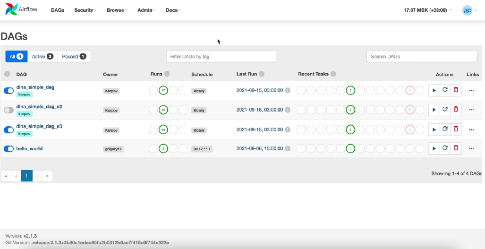

# Лабораторная работа № 2. Airflow

---

## Содержание:

* [Краткая теория и терминология](#краткая-теория-и-терминология)
* [Описание учебного примера](#описание-учебного-примера)
* [Задание](#задание)

---

## Краткая теория и терминология

Для выполнения задания необходимо ознакомиться
с [официальной документацией](https://airflow.apache.org/docs/apache-airflow/stable/).
Далее представлено краткое изложение.

__ETL-процесс__

*ETL-процесс (Extract, Transform, Load)* - это общий термин для процессов миграции данных из одних источников в другие.
Такие процессы включают следующие этапы:

1. Этап извлечения данных.
2. Этап преобразования данных. На данном этапе происходит обработка, очистка и обогащения данных под требования
   бизнес-моделей.
3. Этап загрузки в хранилище.

Таким образом, ETL-процесс нуждается в следующих компонентов:

* Источник данных: внешний ресурс, содержащий нужные нам данных и имеющий методы для доступа к ним.
* Промежуточная область: вспомогательных таблицы, используемые временно для преобразования данных в необходимый для
  хранения формат.
* Получатель данных: хранилище (файл, база данных и пр.), куда необходимо сохранить данные из источника.

Примеры инструментов для создания ETL-процессов: *Apache Airflow, Spark, Kafka.*

__Airflow__

*Apache Airflow* - это открытое программное обеспечение, написанное на языке Python, которое позволяет создавать,
выполнять, мониторить и оркестровывать процессы обработки данных.

Процессы обработки данных представляются в виде направленного ациклического графа или
[__DAG__](https://airflow.apache.org/docs/apache-airflow/stable/core-concepts/dags.html), узлами которого
являются [задачи или Task](https://airflow.apache.org/docs/apache-airflow/stable/core-concepts/tasks.html#tasks).

Основные элементы Airflow:

* __Web Server Airflow__ - отвечает за пользовательский интерфейс и дает возможность
  контролировать пайплайны. Основные задачи:
    * Внешний вид DAG-a.
    * Статус выполнения (их получает из метаданных Airflow).
    * Перезапуск (как тасок, так и DAG-ов).
    * Отладка.
* __Sheduler__ - планировщик. Основные задачи:
    * Анализирует DAG-и (ищет те, которые готовы к запуску).
    * Создает __DAG Run__ (это экземпляр DAG-а.) с конкретным __execution_date__ (начало предыдущего периода).
    * Создает __Task Instance__ (это экземпляр задачи, привязываются к DAG, у них так
      же определен параметр execution_date).
    * Ставит таски в очередь.
* __Executor__ - механизм, с помощью которого запускаются экземпляры задач. Он
  работает в связке с планировщиком. Существует две категории:
    * Локальные - исполняются на той же машине, на которой есть планировщик.
    * Нелокальные - могут запускать таски удаленно.
* __Worker__ - процесс, в котором исполняются задачи. В зависимости от executor-a он
  может быть размещен локально (на той же машине, что и планировщик), либо на
  отдельно машине/машинах.
* __Metadata Database__ - база метаданных. В ней хранится информация о состоянии
  всех пайплайнов: DAG (абстрактные DAG-и), DAG Run (конкретные инстансы DAG-ов), Task Instance и пр.

Внешний вид интерфейса:



Внешний вид DAG-а:


Схематично можно изобразить следующим образом:


На схеме видим, что:

* UI (пользовательский интерфейс) находится на Web Server-е.
* Воркеры могут находиться на той же самой машине, что и планировщик, и executor.
* Воркеры, планировщик и веб сервер смотрят в одну папку DAG Directory (тут лежат описание DAG-ов в виде питоновских
  скриптов).
* Воркеры, планировщик и веб сервер смотрят в одну базу метаданных.

---

## Описание учебного примера

Директория `dags`:

* `configs.py` - модуль с общими настройками для сервисов и конвейеров.
* `db_service.py` - модуль для работы с базой данных.
* `ml_service.py` - модуль для построения ml-моделей.
* `form_predictions_dag.py` - DAG для формирования и записи в базу данных предсказаний.
* `load_data_and_create_model_dag.py` - DAG для загрузки данных и тренировки модели.

Директория `db`:

* `init.sql` - SQL-запрос для создания таблицы в базе данных.
* `datasets/titanic.csv` - набор данных, который будем обрабатывать.

`.env` - текстовый файл с глобальными переменными.

Для запуска примера необходимо открыть терминал в директории `airflow` и выполнить команду:

```bash
docker compose up --build
```

Далее надо будет подождать, пока в командной строке не увидите следующее сообщение:


После можно перейти по адресу [http://localhost:8080](http://localhost:8080). В поля авторизации введите имя
пользователя `airflow` и пароль `airflow`.

На главной страничке будут доступны DAG-и:


Все DAG-и отключены, для их включения необходимо включить переключатель слева.
Самым первым DAG-ом должен отработать `load_data_and_create_model`, для этого в столбце `Actions` необходимо нажать на
кнопку запуска и выбрать `Trigger DAG`. После чего данный DAG выполниться, можно посмотреть его выполнение, нажав на
него:


Как можно видеть, все задачи выполнены успешно. Также можно в директории `models` увидеть сериализованную модель, а в
таблице `titanic` записи, которые далее будем обновлять прогнозами.

`form_predictions` выполняется раз в минуту, поэтому его триггерить необязательно, он сам запуститься по расписанию.
Через какое-то время у вас будет похожая картина:


Данный DAG случайным образом отбирает данные из БД и записывает для них предсказание. Ниже представлен пример работы:


---

## Задание

В качестве предметной области для вас выступает курс валют.

0. Изучите учебный пример, посмотрите, что можно будет использовать или заменить.
1. Выберите несколько (от 3-х) валют, к которым вы хотите определять курс рубля (к примеру, доллар, евро,
   йена и пр.).
2. Найдите и изучите внешний ресурс, с которого можно загружать данные (к примеру, можно
   использовать [эти](https://habr.com/ru/articles/537784/)).
3. Продумайте структуры необходимых таблиц, опишите `SQL-скрипт` на создание таблиц для СУБД `PostgreSQL`.
4. Создайте DAG для загрузки данных из источника в БД за текущий день. Для этого необходимо реализовать следующие
   задачи:
    * Вызов метод ресурса для извлечения данных.
    * Выделение необходимых данных, преобразование при необходимости.
    * Сохранение данных в базу данных.
    * Данный DAG должен запрашивать данные из источника каждый час.
    * В качестве даты начала работы задайте `2022-12-01`.
5. Создайте второй DAG, который содержит оператор `EmailOperator` для отправки статистики курса рубля за прошедший день
   на вашу почту.

Дополнительные задания:

6. Создайте третий DAG на загрузку исторических данных из источника. Данный DAG должен отработать один раз и загрузить
   данные за прошедший год.
7. Напишите DAG для отправки на почту график или таблицы изменения курса рубля к каждой из валют. Данный DAG должен
   отрабатывать каждое воскресенье, для этого необходимо использовать сенсор `DayOfWeekSensor`.
8. Создайте DAG и модель для предсказания будущих значений с сохранением данных или отправкой на почту.
