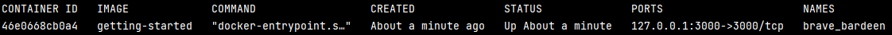
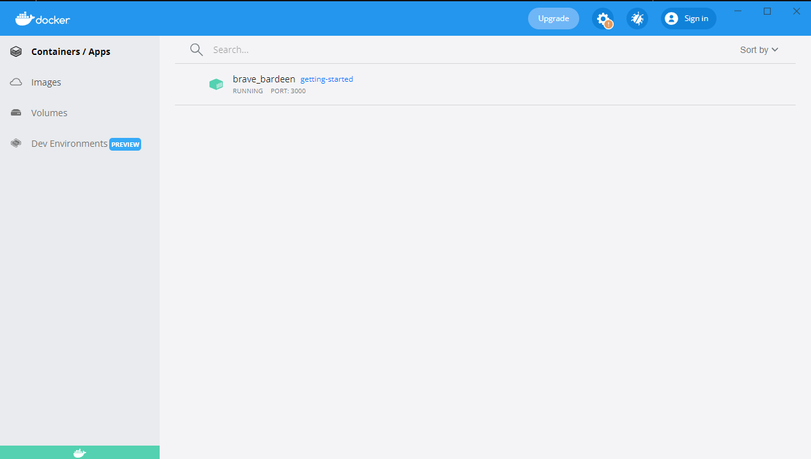

# Docker

___

## Содержание:

* [Описание](#описание)
* [Инструкции по установке](#инструкции-по-установке)
* [Примеры](#примеры)

---

## Описание

Docker - это технология контейнерезации приложения, позволяющая развертывать приложение на разных устройствах.
Контейнеризация является видом виртуализации, которая контролируется ядром операционной системы и
не требует виртуализации оборудования. Контейнер, внутри которого находится наше приложение, использует ОС Linux
(по умолчанию Ubuntu, но можно поменять и на другие), использует ресурсы, запрашивая их у ОС основной машины.

### Основная терминология:

* __Image (образ)__ - это шаблон, по которому можно запустить контейнер. Образ содержит необходимый набор инструкций,
  необходимый для запуска контейнера. Некоторые стандартные образы хранятся в специальном репозитории __Docker Hub__.
* __Container (контейнер)__ - это запущенный на исполнение экземпляр образа.
* __Docker demon__ - это фоновый процесс, управляющий объектами Docker и обрабатывающий запросы Docker API.
* __Docker client__ - это инструмент командной строки, который позволяет пользователю взаимодействовать с демоном.
  Каждый раз, когда будете использовать `docker <команда>`, клиент отправляет запрос на обработку демону.

### Dockerfile

Как было сказано, образ содержит инструкции для разворачивания контейнера.
Все эти инструкции описываются в виде специальных инструкций в одноименном __Dockerfile__ и создается с помощью простого
текстового редактора.
Ниже приведен пример:

```dockerfile
FROM node:18-alpine
WORKDIR /app
COPY . .
RUN yarn install --production
CMD ["node", "src/index.js"]
EXPOSE 3000
```

Рассмотрим инструкции из примера:

* `FROM` - задаёт базовый или родительский образ.
* `WORKDIR` - задает рабочую директорию внутри контейнера, в которой будут выполняться следующие команды.
* `COPY` - копирует в контейнер файлы из папки (`.` обозначает из текущей директории).
* `RUN` - выполняет команду и создает слой внутри себя. С помощью данной команды можно устанавливать внешние пакеты.
* `CMD` - описывает команду, которую нужно выполнить, когда контейнер запущен. Может быть только одна команда. Аргументы
  могут быть переопределены.
* `EXPOSE` - указывает на необходимость открыть порт.

Также полезные инструкции:

* `ENV` - устанавливают переменные среды.
* `ENTRYPOINT` - описывает команду, которая выполняется во время работы контейнера, но аргументы нельзя переопределить.
* `VOLUME` - создает точку монтирования для работы с постоянным хранилищем. Поскольку после остановки контейнера все
  созданные в ходе работы данные будут удалены, то полезно создать хранилище, которое будет существовать вне зависимости
  от контейнера.

__Основные команды для работы с образами и контейнерами:__

* Создание образа с Dockerfile в текущей директории: ```docker build .``` (если нужно указать название
  образа ```docker build -t <название> .```).
* Запуск контейнера из образа: ```docker run <название образа>```.
* Вывод списка всех запущенных и работающих контейнеров: ```docker ps```.
* Вывод логов контейнера: ```docker logs --follow <название контейнера>```.
* Подключение к контейнеру: ```docker exec -it <название контейнера> bash```.
* Остановка и удаление контейнера: ```docker rm --force <название контейнера>```.

### Docker Compose

Docker Compose - это инструмент, помогающий разворачивать несколько контейнеров одновременно. Для этого создается
специальный файл на языке `YAML` `docker-compose.yml`. Рассмотрим пример такого файла.

Допустим у нас есть следующая директория с приложением `app`:

```
.
├── docker-compose.yml
├── .env
└── app
    ├── run.py
    ├── requirements.txt
    └── Dockerfile
```

Дадим пояснение к некоторым элементам:

* `.env` - текстовый файл, в котором хранятся глобальные переменные. Например, доступ к базе данных, конфигурации
  приложения.
* `run.py` - python-файл для запуска приложения `app`.
* `requirements.txt` - файл с необходимыми зависимостями для корректной работы приложения.

`Dockerfile` выглядит следующим образом:

```dockerfile
# Выкачиваем из dockerhub образ с python версии 3.9
FROM python:3.9
# Устанавливаем рабочую директорию для проекта в контейнере
WORKDIR /app
# Скачиваем/обновляем необходимые библиотеки для проекта 
COPY ./requirements.txt /app
RUN pip3 install --upgrade pip -r requirements.txt
# |ВАЖНЫЙ МОМЕНТ| копируем содержимое папки, где находится Dockerfile, 
# в рабочую директорию контейнера
COPY . /app
# Запускаем наше приложение
CMD ["python", "run.py"]
# Устанавливаем порт, который будет использоваться для сервера
EXPOSE 8000
```

`app` - это веб-приложение, которое нуждается в базе данных. Поэтому необходимо создать также одновременно контейнер,
содержащий СУБД `PostreSQL` с примонтированным `volume`. Таким образом, файл `docker-compose.yml` будет выглядеть
следующим образом:

```yaml
version: "3"

services:

  app-db:
    image: postgres:13
    container_name: app-db
    restart: unless-stopped
    environment:
      POSTGRES_DB: "${POSTGRES_DB}"
      POSTGRES_USER: "${POSTGRES_USER}"
      POSTGRES_PASSWORD: "${POSTGRES_PASSWORD}"
    ports:
      - 5432:5432
    env_file:
      - .env
    volumes:
      - db-data:/var/lib/postgresql/data
    networks:
      app-network:

  app:
    build: ./app
    container_name: app
    restart: unless-stopped
    healthcheck:
      test: curl http://localhost:8000/ping
      interval: 30s
      timeout: 5s
      retries: 20
    ports:
      - 8000:8000
    env_file:
      - .env
    depends_on:
      - app-db
    networks:
      app-network:

volumes:
  db-data:

networks:
  app-network:
    name: app-network
```

Рассмотрим каждый блок:

__services__

В данном блоке мы перечисляем и настраиваем сервисы, которые нам необходимы. Как можно видеть у нас два
сервиса: `app-db`, содержащий СУБД, и наше приложение `app`. Рассмотрим настройки запуска каждого сервиса.

`app-db`:

* `image` - указывает образ, из которого будет создан данный сервис. В данном случае СУБД `postgres:13`.
* `container_name` - указывает название контейнера.
* `restart` - политику перезапуска контейнера (возможные значения `no` - не перезапускает контейнер, `always` - всегда,
  пока не удален, `on-failure` - перезапуск в случае возникновения ошибки, `unless-stopped` - политика
  аналогичная `always` за исключением того, что не срабатывает, если была ручная или иным образом внешняя остановка).
* `environment` - блок, в котором можно задать явно значения к переменным среды (`<переменная сервиса>: <значение>`).
  Таким образом  `${<название переменной>}` значение задается из существующей глобально переменной
  среды.
* `env_file` - блок, в котором задается путь к файлу с переменными среды.
* `ports` - в данном блоке связываются порты, открытые внутри контейнера, с теми, которые будут прослушиваться
  снаружи (`<внешний порт>: <внутрениий порт>`).
* `volumes` - список примонтированных хранилищ.
* `networks` - сети, по которым контейнеры взаимодействуют друг с другом. Необходимо указывать, если нужно
  взаимодействовать с другими сервисами, так как они изолированы друг от друга.

`app` похож на `app-db` с некоторыми отличиями:

* `build` - блок, в котором указывается путь к директории до `Dockerfile`, откуда будет создан образ для сервиса.
* `healthcheck` - блок, в котором задается команда, сигнализирующая Docker демону, что контейнер работает корректно, и
  условия ее вызова (интервал, частоту попыток, время ожидания).
* `depends_on` - это блок, содержащий зависимости от других сервисов. Для нашего примера приложение app не может
  корректно работать без БД, поэтому сначала пытаемся запустить сервис с БД. в случае, если контейнер `app-db` не
  поднялся, то `app` тоже не поднимется.

__volumes__

В данном блоке перечисляются хранилища, которые необходимо создать перед запуском контейнеров. Если хотя бы в одном
сервисе указан `volume`, то его необходимо прописать в данном блоке.

__networks__

В данном блоке прописываются сети для сервисов. Тоже обязательно прописывать, если хотя бы в одном из сервисов прописан
блок `networks`.

__Команды для работы с docker compose:__

* Поднятие контейнеров из файла `docker-compose.yml` в текущей директории: ```docker compose up``` (также полезно
  добавить в конце флаг `--build`, чтобы в случае изменений в сервисах пересобирать образы).
* Остановка контейнеров из файла композа: ```docker compose stop```.

### Docker Engine и Docker Desktop

__Docker Engine__ - это клиент-серверное приложение для работы с Docker и включает следующее:

* Сервер, по сути являющийся долго работающим приложением, называемым демоном.
* REST API, определяющее интерфейсы для взаимодействия, которые могут использовать другие программы.
* Консольный (CLI) клиент.


__Docker Desktop__ - это настольное приложение от разработчиков Docker, которое упрощает сборку, отладку, развертывание
и тестирование контейнеров. С недавних пор оно стало доступно на ОС __Windows__, __MacOS__ и __Linux__.

---

## Инструкции по установке

__Шаг 1: Настройка виртуализации__

Для начала необходимо включить возможность виртуализации на вашей машине.

На машинах с ОС __Windows__ можно узнать включена ли данная функция, нажав `Left Ctrl` + `Shift` + `Esc` и перейдя в *
Производительность* → *ЦП*.


Для пользователей __Ubuntu__ с помощью команды:

```bash
lscpu
```

Результат должен быть таким:


[Инструкции для MacOS](https://gusti-online.ru/kak-vklyucit-virtualizaciyu-na-mac-os/).

В случае, если данная функция отключена, то ее нужно будет включить через __BIOS__
. [Общая инструкция](https://lumpics.ru/how-enable-virtualization-in-bios/)
и [специальная для
пользователей Windows](https://support.microsoft.com/ru-ru/windows/включение-виртуализации-на-компьютерах-windows-11-c5578302-6e43-4b4b-a449-8ced115f58e1)
.
__Внимание: для разных устройств переход в BIOS осуществляется по-разному.__

__Шаг 2: Установка Docker__

Перейдите по [ссылке](https://docs.docker.com/get-docker/), выберите свою ОС и выполните инструкции по установке.

---

## Примеры

Давайте закрепим теорию и попробуем Docker в действии на двух примерах.

### Простой Docker контейнер

1. Скачиваем репозиторий с приложением из официального репозитория Docker.

```bash
git clone https://github.com/docker/getting-started-app.git
```

2. Перейдите в директорию приложения:

```bash
cd <путь к директории getting-started-app>
```

3. Создайте Dockerfile со следующим содержимым:

```dockerfile
FROM node:18-alpine
WORKDIR /app
COPY . .
RUN yarn install --production
CMD ["node", "src/index.js"]
EXPOSE 3000
```

4. Соберите образ:

```bash
docker build -t getting-started .
```

5. Запустите контейнер следующей командой:

```bash
docker run -dp 127.0.0.1:3000:3000 getting-started
```

Теперь вы можете убедиться, что ваш контейнер работает:

* Запустив команду ```docker ps```



* Перейдя по ссылке [http://localhost:3000/](http://localhost:3000/).
* Открыв Docker Desktop:



### Пример Docker Compose

1. Перейдите в директорию `docker-compose-example`:

```bash
cd <путь к директории docker-compose-example>
```

2. Откройте папку `app` и заполните Dockerfile следующим образом:

```dockerfile
FROM python:3.7-alpine
WORKDIR /app
ENV FLASK_APP=app.py
RUN apk add --no-cache gcc musl-dev linux-headers
COPY requirements.txt requirements.txt
RUN pip install -r requirements.txt
EXPOSE 5000
COPY . .
CMD ["flask", "run"]
```

3. Далее заполните `docker-compose.yml` следующим:

```yaml
services:

  redis:
    image: "redis:alpine"
    networks:
      app-network:

  app:
    build: ./app
    ports:
      - "8000:5000"
    env_file:
      - .env
    depends_on:
      - redis
    networks:
      app-network:

networks:
  app-network:
    name: app-network
```

4. Выполните команду:

```bash
docker compose up --build 
```

Теперь вы можете перейти на [http://localhost:8000/](http://localhost:8000/) и посмотреть на то, что все работает. Также
можете убедиться, выполнив команду: ```docker ps``` или зайдя в Docker Desktop.

---