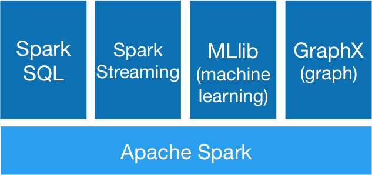
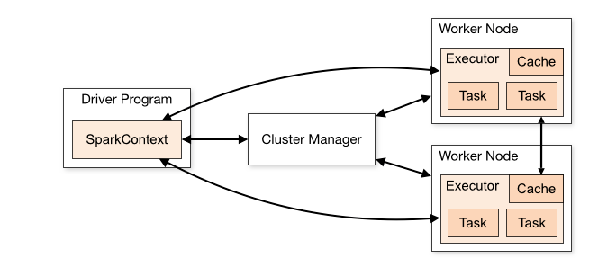
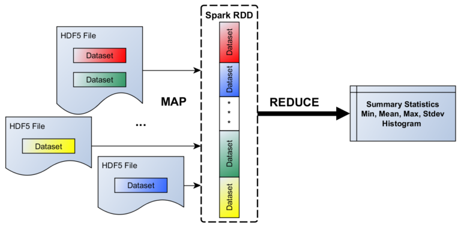
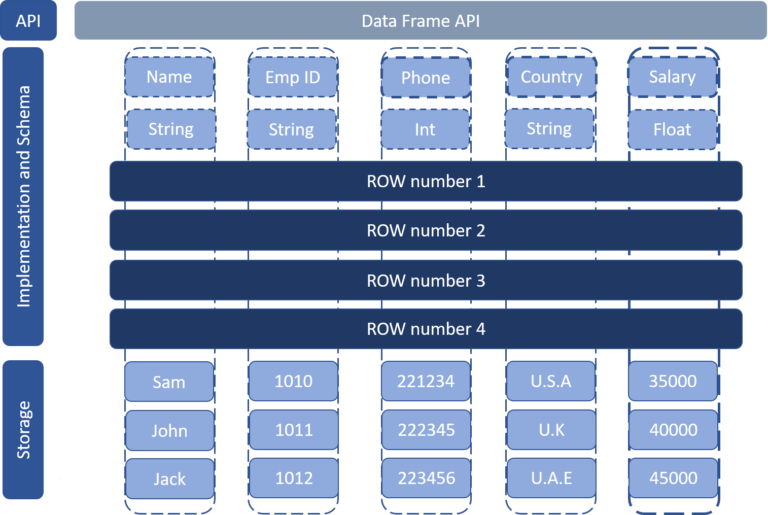

# Лабораторная работа № 3. Spark

---

## Содержание:

* [Краткая теория и терминология](#краткая-теория-и-терминология)
* [Описание учебного примера](#описание-учебного-примера)
* [Задание](#задание)

---

## Краткая теория и терминология

__Apache Spark__ - это фреймворк для распределенных вычислений, использующий резидентные (in-memory) вычисления.
Данный фреймворк состоит из нескольких компонент:

* *Spark SQL* - для выполнения операций с данными, таких как обычные запросы на языке SQL в СУБД. Spark имеет как
  собственное API, так и поддерживает SQL.
* *Spark Streaming* - потоковый механизм Spark и особенно структурированный потоковый механизм Spark - предназначен для
  анализа потоковых данных. Стандартный API Spark поможет обрабатывать данные в одинаковом стиле независимо от того,
  являются ли данные потоковыми или пакетными.
* *Spark MLlib* - для машинного обучения и дальнейших расширений для глубокого обучения.
* *GraphX* - для интенсивного использования графовых структур данных

Spark - превосходный инструмент для инженеров по обработке данных, который помогает выполнять следующие этапы:

1. Потребление данных - Spark может потреблять данные из различных источников. Если невозможно найти поддерживаемый
   формат, то можно создать свой.
2. Улучшение качества данных - перед обработкой данных, вероятно, потребуется проверка их качества. Поэтому производится
   проверка с целью того, чтобы убедится все ли данные у нас корректны, имеют верный формат и прочее.
3. Преобразование данных - объединение с другими наборами данных, применение специальных функций, агрегирование и
   прочее.
   4.Загрузка и публикация результатов обработки - загрузка данных в хранилище, используя инструменты бизнес-анализа,
   вызывая прикладные интерфейсы или просто сохраняя в файл.

__Приложение Spark__

Каждое приложение Spark состоит из управляющего процесса - __драйвер (Driver)__ и набора исполнительных процессов - 
__исполнители (Executors)__.

__Spark Driver__

Driver запускает метод `main()` нашего приложения. Здесь создаётся `SparkContext`. Обязанности Spark Driver:

* Запускает задание на узле в нашем кластере или на клиенте и планирует его выполнение с помощью менеджера кластера.
* Отвечает на пользовательскую программу или ввод
* Анализирует, планирует и распределяет работу между исполнителями
* Хранит метаданные о запущенном приложении и отображает в веб-интерфейсе

__Spark Executors__

Исполнитель (Executor) – распределённый процесс, который отвечает за выполнение задач. У каждого приложения Spark
собственный набор исполнителей. Они работают в течение жизненного цикла отдельного приложения Spark.

* Исполнители делают всю обработку данных задания Spark.
* Сохраняют результаты в памяти, а на диске – только тогда, когда это специально указывается в программе-драйвере (
  Driver Program).
* Возвращает результаты драйверу после их завершения.
* Каждый узел может иметь от 1 исполнителя на узел до 1 исполнителя на ядро.

__Процесс работы приложения:__

1. Наше автономное приложение запускается и инициализирует SparkContext. Только при наличии SparkContext приложение
   называется драйвером.
2. Наша программа-драйвер (Driver program) запрашивает у менеджера кластеров (Cluster Manager) ресурсы для запуска
   исполнителей.
3. Менеджер кластеров запускает исполнителей.
4. Наш драйвер запускает собственно код Spark.
5. Исполнители запускают задания и отправляют результаты драйверу.
6. SparkContext останавливается, а исполнители закрываются и возвращают ресурсы обратно в кластер.

__Ленивые (отложенные) вычисления__

При выполнении преобразований над вашим набором данных Spark строит ациклический граф, например `Map → Reduce`. Данный
граф оптимизируется с помощью встроенного средства оптимизации Catalyst. Но сами преобразования не вычисляются, данные
не изменяются. Когда применяется действие в наборе данных, все заданные преобразования выполняются и, если необходимо,
изменяются данные.

__RDD VS DataFrame__

__RDD (resilient distributed dataset, устойчивый распределенный набор данных)__ - абстракция распределенной памяти,
которая позволяет выполнять вычисления непосредственно в памяти крупных кластеров, способом устойчивым к критическим
сбоям.

RDD были первым способом хранения и обработки данных в Spark и на данный момент остаются в звене низкого уровня
хранения данных в Spark. Данный способ хранения данных рекомендуется использовать в следующих случаях:

* когда не нужна схема;
* когда разрабатываются преобразования и действия на нижнем уровне;
* когда работаете с legacy.

В остальных случаях рекомендуется использовать надстройку над RDD DataFrame.

__DataFrame__ - это набор записей, организованных в форме именованных столбцов. Такая форма аналогична таблице в
реляционных БД, как показано ниже на рисунке.

Главная концепция DataFrame - это прикладной API, Который доступен на разных языках Java, Python, Scala и R.

Фреймы включают схему, в которой описываются названия столбцов и тип данных (описание таблиц в БД).

DataFrame и RDD являются неизменяемым хранилищем данных. Неизменяемость определяется как невозможность внесения
изменений.

---

## Описание учебного примера

Для запуска примера необходимо запустить согласно [инструкции](./cluster/README.md) кластер, перейти
на [http://localhost:8889/](http://localhost:8889/) и рассмотреть ноутбуки в папке `notebooks`.

---

## Задание

При помощи Spark без использования Pandas, Scikit-Learn необходимо провести:

1. Анализ и обработку данных.
2. Построить модель машинного обучения для решения задачи.

Можете выбрать свой набор данных, в качестве примеров задач могут быть следующие:

1. Построить рекомендательную систему фильмов по набору данных [MovieLens](https://grouplens.org/datasets/movielens/).
2. Нахождение зараженных компьютеров [Malware prediction](https://www.kaggle.com/c/microsoft-malware-prediction).
