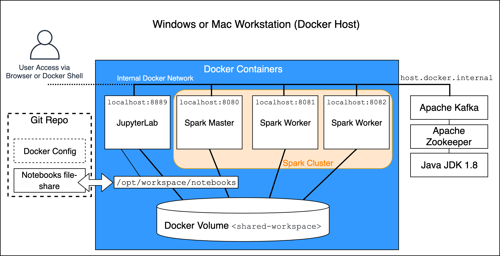

# Запуск Spark кластера

Данный кластер состоит из двух узлов и Spark-мастер, а также JupyterLab окружение.



## Spark and Hadoop конфигурация и информация о выпуске

Spark версия `3.5.0`, Hadoop версия `3`, Python версия `3.9.6`.

Apache Spark запущен в автономном режиме и контролирует собственных мастера и узлы.

Apache Spark с поддержкой Apache Hadoop используется для того, чтобы позволить кластеру имитировать распределенную
файловую систему HDFS с использованием общего тома `shared-workspace`.

# Сборка

## Быстрый старт

Убедитесь, что среде Docker выделено достаточно памяти:

- Настройте минимум 4 ГБ ресурсов Docker, в идеале 8 ГБ

Соберите образы с помощью следующей команды:

 ```bash
 build.sh
 ```

Или вручную по отдельности:

* Базовый образ кластера

```powershell
docker build -f cluster-base.Dockerfile -t cluster-base .
```

* Базовый образ для Spark

```powershell
docker build --build-arg spark_version="3.5.0" --build-arg hadoop_version="3" -f spark-base.Dockerfile -t spark-base .
```

* Образ Spark-мастера

```powershell
docker build -f spark-master.Dockerfile  -t spark-master .
```

* Образ Spark-узла

```powershell
docker build -f spark-worker.Dockerfile -t spark-worker .
```

* Образ JupyterLab

```powershell
docker build --build-arg spark_version="3.5.0" --build-arg jupyterlab_version="3" -f jupyterlab.Dockerfile -t jupyterlab .
```

Создаем volumes перед запуском сервисов:

 ```
 docker volume create --name=hadoop-distributed-file-system
 ```  

Запуск кластера:

```
docker-compose up --detach
```

Перейдите по адресу [http://localhost:8889/](http://localhost:8889/).

## Обзор образов

Следующие образы были созданы:

* `cluster-base` - это предоставляет общий каталог (`/opt/workspace`) для моделирования HDFS.
* `spark-base`  - базовый образ Apache Spark для создания Spark-мастера и Spark-узлов.
* `spark-master` - Spark-мастер, который позволяет рабочим узлам подключаться через `SPARK_MASTER_PORT`, также
  предоставляет доступ к Spark-мастер. Веб-страница пользовательского интерфейса (порт 8080).
* `spark-worker` - из этого образа можно запустить несколько рабочих контейнеров Spark для формирования кластера.
* `jupyterlab` - JupyterLab и Python окружения, запущенный поверх кластеров.

## Запуск кластера

```
docker-compose up --detach
```

## Остановка кластера

```
docker-compose down
```

## Директория JupyterLab ноутбуков

Все ноутбуки размещены в папке `./local/notebooks`, которая была примонтирована к `/opt/workspace/notebooks` к
JupyterLab Docker.
